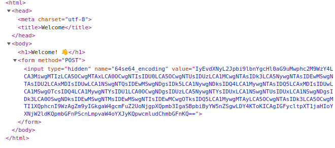

## 64se64

### Descripion
--------------
"Welcome! 👋"을 출력하는 html 페이지입니다. 소스 코드를 확인하여 문제를 풀고 플래그를 획득하세요.
플래그의 형식은 DH{...} 입니다.

### 접속정보
    Host:host3.dreamhack.games
    Port: 9686/tcp -> 31337/tcp


## 풀이

### 웹사이트 소스코드 확인
해당 웹페이지를 들어가서 F12키를 누르면 소스코드를 확인

소스코드





### base64 디코딩
해당 소스코드를 보면 "hidden" 타입을 가진 인풋 태그가 있는데 이 value의 값을 base64로 디코더하면 파이썬 코드가 나온다.

```python
#!/usr/bin/env python3
asc=[68, 72, 123, 98, 101, 48, 52, 54, 98, 55, 53, 50, 50, 97, 97, 50, 101, 50, 56, 102, 50, 55, 54, 101, 48, 99, 57, 49, 48, 53, 50, 49, 102, 50, 51, 97, 48, 53, 56, 55, 48, 48, 53, 97, 56, 51, 55, 55, 51, 55, 48, 97, 49, 49, 101, 53, 101, 52, 100, 99, 49, 53, 102, 98, 50, 97, 98, 125]
arr=[0 for i in range(68)]
for i in range(0,68):
    arr[i]=chr(asc[i])
flag=''.join(arr)
print(flag)
```

### 파이썬 코드 실행
해당 코드를 실행하면 flag값을 출력한다.

    DH{be046b7522aa2e28f276e0c910521f23a0587005a8377370a11e5e4dc15fb2ab}


## 정답
>DH{be046b7522aa2e28f276e0c910521f23a0587005a8377370a11e5e4dc15fb2ab}