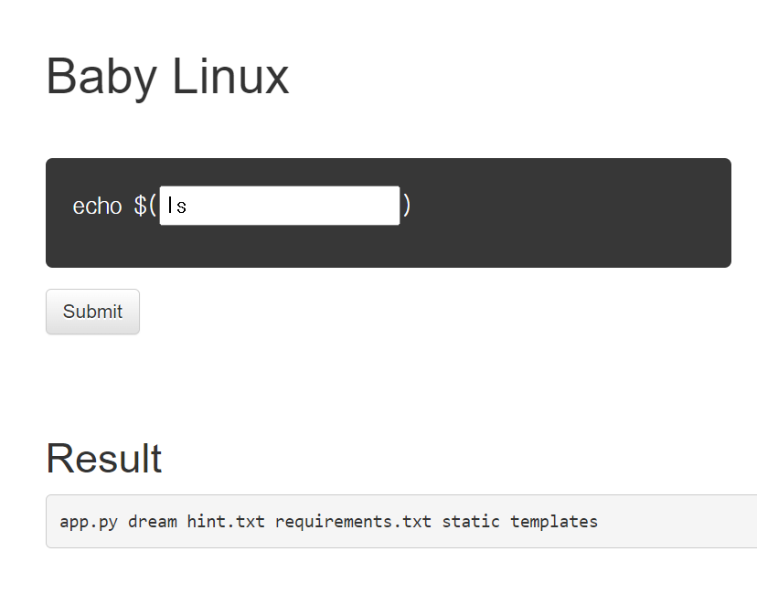
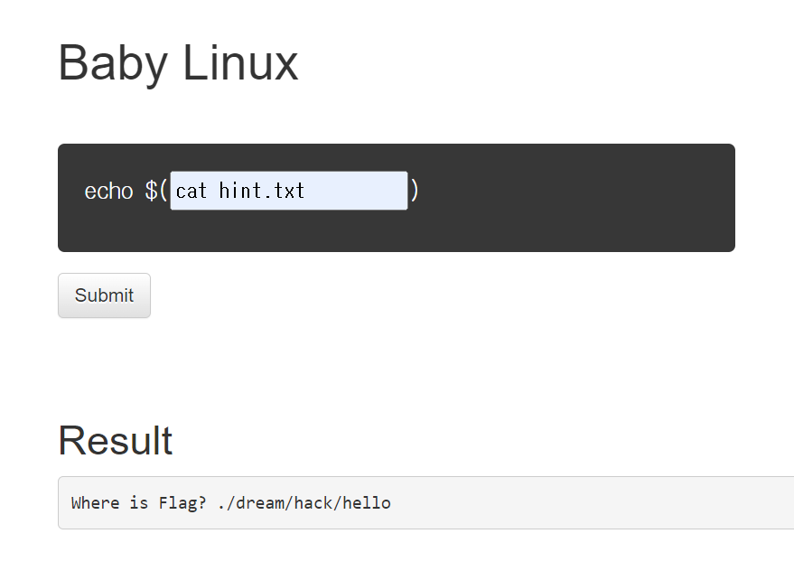
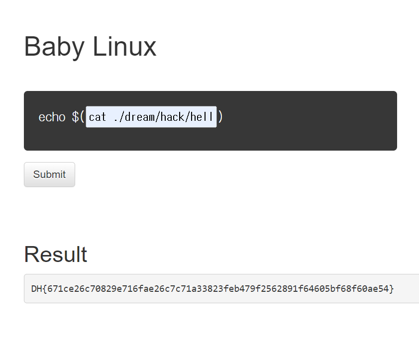

# baby-linux
### 문제 설명
### Descripion
--------------
리눅스 명령어를 실행하는 웹 서비스가 작동하고 있습니다.
해당 웹 서비스의 코드가 첨부파일로 주어집니다.

flag.txt 파일을 찾아 출력하여 플래그를 획득하세요! 

플래그 형식은 DH{...} 입니다.


### 접속정보
    Host:host3.dreamhack.games
    Port: 9686/tcp -> 31337/tcp


## 풀이

### 소스코드 확인
첨부 파일 "app.py"를 받고 소스코드를 확인한다.

**소스코드**
```python
#!/usr/bin/env python3
import subprocess
from flask import Flask, request, render_template

APP = Flask(__name__)

@APP.route('/', methods=['GET', 'POST'])
def index():
    if request.method == 'POST':
        user_input = request.form.get('user_input')
        cmd = f'echo $({user_input})'
        if 'flag' in cmd:
            return render_template('index.html', result='No!')

        try:
            output = subprocess.check_output(['/bin/sh', '-c', cmd], timeout=5)
            return render_template('index.html', result=output.decode('utf-8'))
        except subprocess.TimeoutExpired:
            return render_template('index.html', result='Timeout')
        except subprocess.CalledProcessError:
            return render_template('index.html', result='Error')

    return render_template('index.html')

if __name__ == '__main__':
    APP.run(host='0.0.0.0', port=8000)
```
### 웹사이트 접속

파일들을 확인 하기위해 ```ls``` 명령어로 확인한다.



힌트 파일의 내용을 열기위해 ```cat hint.txt```를 입력한다.



flag.txt가 ./dream/hack/hello 에 위치한다는 것을 알았으니 flag.txt의 내용을 열기위한 코드를 작성한다.


**이때 주의 소스코드에서 인풋으로 "flag"라는 단어가 들어가면 "NO!"를 출력한다.**

### 해결책(와일드카드)
```*``` 문자를 사용하면 a-z, 0-9 범위 내 임의의 개 이상 문자로 대체함

**즉, ```cat ./dream/hack/hello/fl*g.txt```를 입력하면 flag.txt를 실행시킨다.**


###



## 정답
>DH{671ce26c70829e716fae26c7c71a33823feb479f2562891f64605bf68f60ae54}