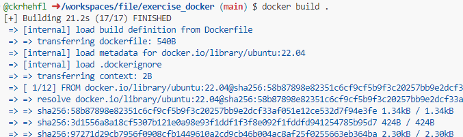
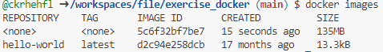
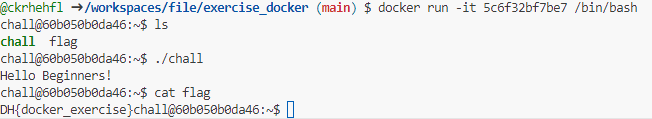

## Docker
### 문제설명
### Descripion
--------------
Docker 실습을 위한 문제입니다. 주어진 Dockerfile을 빌드하여 이미지를 생성하고 컨테이너를 실행해 보세요!

플래그의 형식은 DH{...} 입니다.

    ssh with
    id: chall
    password: dhbgssh

### 접속정보
    Host:host3.dreamhack.games
    Port: 9686/tcp -> 31337/tcp

## 풀이

### 도커 설치

아래 명령을 순서대로 실행하여 도커 엔진을 설치.
``` 
1 $ sudo apt-get update
2 $ sudo apt-get install \
3     ca-certificates \
4     curl \
5     gnupg
```
```
1 $ sudo mkdir -m 0755 -p /etc/apt/keyrings
2 $ curl -fsSL https://download.docker.com/linux/ubuntu/gpg | sudo gpg --dearmor -o /etc/apt/keyrings/docker.gpg
```
```
1 $ echo \
2   "deb [arch="$(dpkg --print-architecture)" signed-by=/etc/apt/keyrings/docker.gpg] https://download.docker.com/linux/ubuntu \
3   "$(. /etc/os-release && echo "$VERSION_CODENAME")" stable" | \
4   sudo tee /etc/apt/sources.list.d/docker.list > /dev/null
```
```
1 $ sudo apt-get update
2 $ sudo apt-get install docker-ce docker-ce-cli containerd.io docker-buildx-plugin docker-compose-plugin
```
아래 명령어를 입력했을 때 ```Hello form Docker!```가 출력되면 엔진이 설치가 된 것.
```
1 $ sudo docker run hello-world
```
### 도커 빌드

문제 파일을 다운로드하여 Dockerfile이 위치한 디렉토리에서 해당 명령어를 실행하여 이미지를 빌드한다.

```
docker build .
```


### 도커 이미지 빌드
빌드가 완료되면 ```docker images``` 명령어로 생성된 이미지를 확인한다.





빌드된 이미지의 ID는 ```5c6f32bf7be7```, 아래 명령어를 실행하여 컨테이너를 생성하고, 컨테이너를 실행하여 ```/bin/bash``` 명령으로 bash 셸을 연다.

```
docker run -it 5c6f32bf7be7 /bin/bash
```

```ls``` 명령을 실행하면 chall과 flag 파일이 존재하는 것을 볼 수 있다.



```./chall``` 명령으로 chall 파일을 실행하면 ```Hello Beginners!```,  ```cat flag```명령어로 flag 파일을 열면 플래그가 출력된다.

## 정답
>DH{docker_exercise}