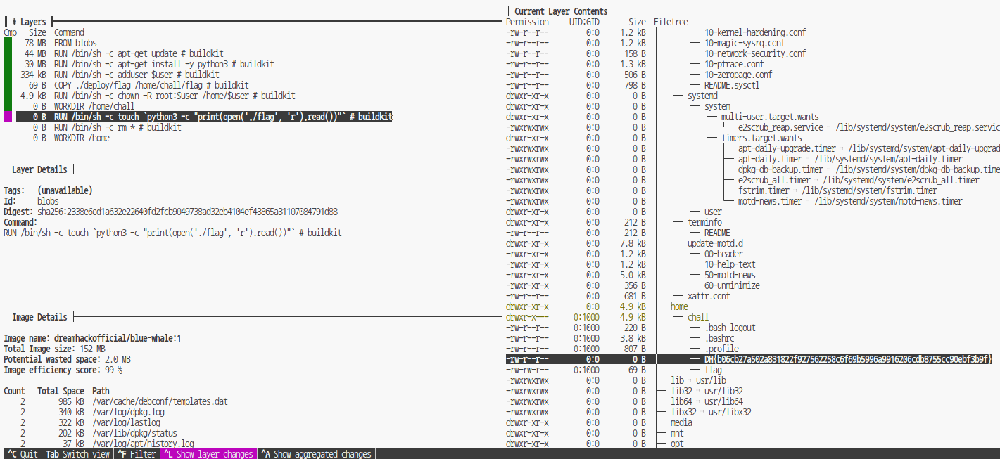
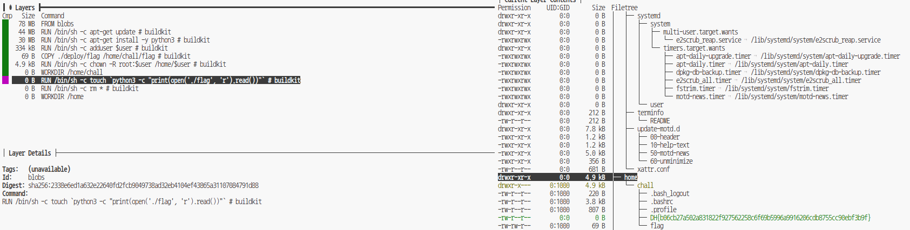
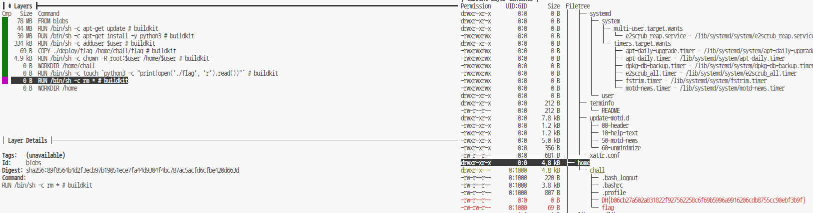

## Docker : blue-whale
### 문제설명
### Descripion
--------------
보코가 여러분에게 도움을 요청합니다. "분명 플래그 파일이 있었는데요... 없어졌어요."

Docker hub의 dreamhackofficial/blue-whale 레포지토리 (TAG:1) 에서 도커 이미지를 다운받을 수 있습니다. 도커 이미지를 분석하여 플래그를 획득하세요.
주어진 Dockerfile은 이미지를 빌드할 때 사용한 파일로, 풀이자가 사용할 수 없습니다.

플래그의 형식은 DH{...} 입니다.

--------------------------------
__Hint:__ https://github.com/wagoodman/dive
### 접속정보
    Host:host3.dreamhack.games
    Port: 9686/tcp -> 31337/tcp

## 풀이

### 도커 이미지 다운로드
```doker pull <이미지명>``` 명령어를 사용하여 
도커 이미지를 다운한다.
```
docker pull dreamhackofficial/blue-whale:1
```

### 도커 분석하기 

```docker inspect <이미지명 또는 ID>``` 명령어를 사용하여 도커 이미지의 자세한 정보를 출력한다.
(ID는 ```docker image``` 로 확인 가능)

```
docker inspect dreamhackofficial/blue-whale:1
```

### 도커 분석 툴

```Hint``` 활용하여 도커 분석 툴을 이용하기


### 설치하기
```
docker pull wagoodman/dive
```

### 실행하기 
설치 후 ```docker run```으로 실행한다.
```
docker run --rm -it \
-v /var/run/docker.sock:/var/run/docker.sock \
wagoodman/dive:latest  dreamhackofficial/blue-whale:1
```


#### 실행화면



```
1. RUN /bin/sh -c touch `python3 -c "print(open('./flag', 'r').read())"` # buildkit

-rw-r--r--         0:0        0 B
DH{b06cb27a502a831822f927562258c6f69b5996a9916206cdb8755cc90ebf3b9f} 


2. RUN /bin/sh -c rm * # buildkit
```

#### 1. 플래그 파일을 출력


#### 2. 삭제 



## 정답
>DH{b06cb27a502a831822f927562258c6f69b5996a9916206cdb8755cc90ebf3b9f}